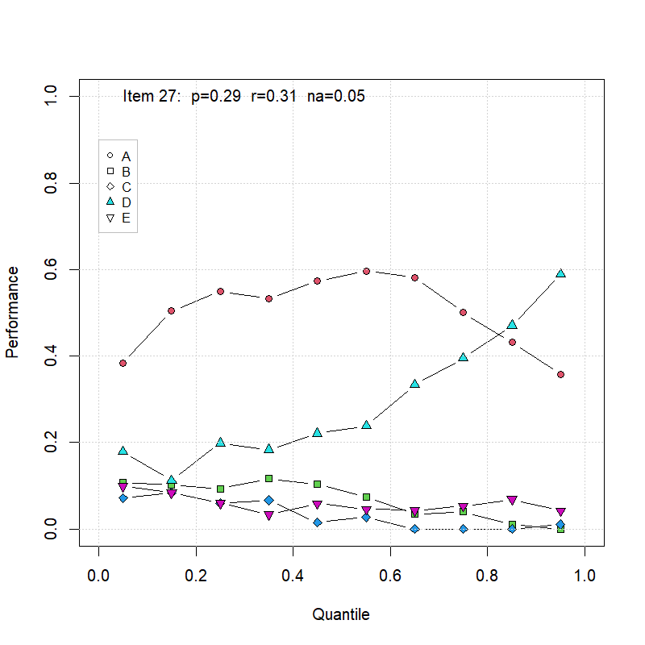

# Characteristic curves of MCQ alternatives

Here is a simple visualization of multiple-choice question (MCQ) alternatives' frequencies depending on the examinees' achievement. To maximize the information displayed on the graph, the achievement is "flattened" across the available interval. That is, instead of the raw achievement the quantile of the achievement is presented on the x-axis. The frequencies of all alternatives are given on the y-axis. The correct alternative is labelled on the legend as the only filled shape.
  
This visualization is beneficial during item analysis after a pilot test where item characteristics and the alternatives' quality are still unknown.

Statistics given on the graph are p (ratio of examinees who correctly answered), r (coefficient of discrimination) and na (ratio of non-answers).

R code can work with any dataset where answers are labelled with selected alternatives (A B C D E) and given as CSV file. The answer key also needs to be imported from CSV.

